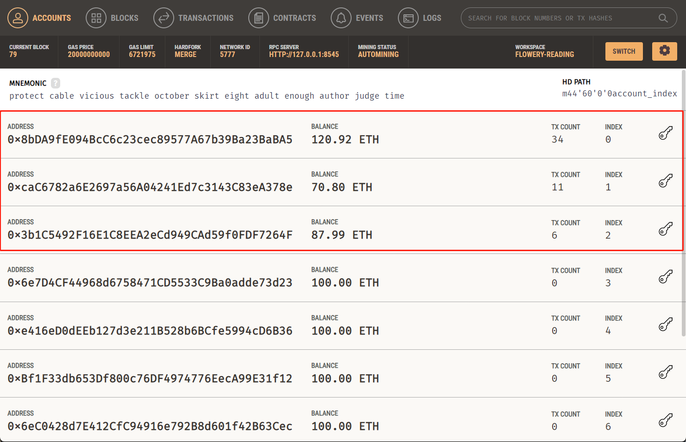

# 去中心化房屋购买系统

⬆ 可以️修改成你自己的项目名。

> 第二次作业要求（以下内容提交时可以删除）：
> 
> 去中心化房屋购买系统，参与方包括：房屋拥有者，有购买房屋需求的用户
>
> 建立一个简易的房屋出售系统，在网站中：
> - 创建一个（ERC721）合约，在合约中发行房屋集合，每个NFT代表一栋房屋。让部分用户免费领取部分房屋NFT，用于后面的测试。
> - 在网站中，用户可以出售，或者使用测试以太币购买房屋。每个用户可以： 
>  1. 用户查看自己拥有的房产列表。并可以挂单出售自己的房屋（挂单包含价格等信息）。
>  2. 用户查看所有出售中的房产，并查询一栋房产的主人，及各种挂单信息。
>  3. 用户选择支付房屋价格对应的测试以太币，购买某个其他用户出售的房产。购买后房产拥有权应当发生变化。
>  4. 平台收取手续费：在一个房产出售完成时，用户支付的部分测试以太币（=某栋房产在平台上的挂单时长（timestamp）* 固定比例 * 房产价格）应该被转入某个特定账户（如合约部署者）。
      。
> - （Bonus，如果想要完成Bonus，可以直接将功能整合进上述要求中）发行一个（ERC20）合约，允许用户将测试以太币兑换成ERC20积分，并使用ERC20积分完成购买房屋的流程。
> - 请大家专注于功能实现，网站UI美观程度不纳入评分标准，但要让用户能够舒适操作。简便起见，可以在网上找图片代表不同房产，不需要将图片上链。

**以下内容为作业仓库的README.md中需要描述的内容。请根据自己的需要进行修改并提交。**

作业提交方式为：**提交视频文件**和**仓库的链接**到指定邮箱。

## 如何运行

补充如何完整运行你的应用。

1. 在本地启动ganache应用。端口默认为8545，chainid为1337。


2. 在 `./contracts` 中安装需要的依赖，运行如下的命令：
    ```bash
    npm install
    ```
3. 在 `./contracts` 中编译合约，运行如下的命令：
    ```bash
    npx hardhat compile
    ```
4. 在 `./contracts`目录下部署合约到本地测试网
    ```bash
    npx hardhat run scripts/deploy.ts --network localhost
    ```
5. 记住部署者的地址（默认为hardhat.config.ts中的第一个私钥对应的地址），将获得的合约地址复制到`./frontend/src/App.tsx`的开头


6. 在 `./frontend` 中安装需要的依赖，运行如下的命令：
    ```bash
    npm install
    ```
7. 在 `./frontend` 中启动前端程序，运行如下的命令：
    ```bash
    npm run start
    ```

---

## 功能实现分析

项目完成了去中心化房产管理系统的主要功能，用户可以通过 ETH 或积分代币（Token）购买房屋。以下是各个功能及其实现方式：
- **总体**
    ```solidity
    import "@openzeppelin/contracts/token/ERC20/ERC20.sol";   
    import "@openzeppelin/contracts/token/ERC721/extensions/ERC721Enumerable.sol";//扩展版的ERC721
    import "@openzeppelin/contracts/access/Ownable.sol"; // 引入Ownable合约进行访问控制
  ```
- **连接钱包**
    - 使用 MetaMask 连接钱包，确保用户身份验证。`connectWallet` 函数负责请求用户账户，设置合约实例和余额。
    ```tsx
    //App.tsx
    const connectWallet = async () => {
    if ((window as any).ethereum) {
      try {
        const accounts = await (window as any).ethereum.request({ method: 'eth_requestAccounts' });
        setAccount(accounts[0]);
        ...
        ...
        // 判断当前用户是否为部署者
        const deployerAddress = await buyMyRoomContract.owner();
        setIsDeployer(deployerAddress.toLowerCase() === accounts[0].toLowerCase());
      } catch (error) {
        console.error('连接钱包时出错', error);
      }
    } else {
      alert('请安装 MetaMask 钱包扩展！');
    }
  };
  ```
- **账户信息显示**
    - 成功连接钱包后，自动显示用户的 ETH 余额、代币余额、交易手续费、以及 ETH/代币的兑换汇率等信息。通过调用 `provider.getBalance` 和合约的 `balanceOf` 等函数获取余额，并在界面上更新显示。
    ```solidity
    //BuyMyRoom.sol
    function getPlatformInfo(address user) public view returns (
        uint256 userEthBalance,
        uint256 userTokenBalance,
        uint256 feePercent,
        uint256 exchangeRate
    ) {
        userEthBalance = user.balance;
        userTokenBalance = paymentToken.balanceOf(user);
        feePercent = listingFeePercent;
        exchangeRate = tokenExchangeRate;
    }
  ```
- **代币兑换**
    - 用户可以使用 ETH 兑换平台积分代币。`exchangeEtherForTokens` 函数接受用户输入的 ETH 数量，将其发送至合约地址，合约计算代币数量并分发给用户。函数执行成功后会更新用户的代币余额。
    ```solidity
    //BuyMyRoom.sol
    function exchangeEtherForTokens() public payable {
        require(msg.value > 0, "Ether required to exchange for tokens");
  
        // 计算用户能得到的积分代币数量
        uint256 tokenAmount = msg.value * tokenExchangeRate;
  
        // 从 tokenOwner 转移代币给用户，确保已授权足够的额度
        require(paymentToken.allowance(tokenOwner, address(this)) >= tokenAmount, "Insufficient allowance from token owner");
        require(paymentToken.transferFrom(tokenOwner, msg.sender, tokenAmount), "Token transfer failed");
  
        // 将收到的 ETH 转发给 tokenOwner
        (bool sent, ) = tokenOwner.call{value: msg.value}("");
        require(sent, "Failed to send Ether to token owner");
  
        emit TokensExchanged(msg.sender, msg.value, tokenAmount);
    }
  ```
- **房产查看**
    - 用户可以查看自己持有的房产及其在售状态，或查看平台上待售房产。调用合约的 `getMyProperties` 和 `getSaleProperties` 函数，获取并显示房产列表，包括房产 ID、价格、所有者、是否在售等信息。
    ```tsx
  //App.tsx  
  const getMyProperties = async () => {
    if (!buyMyRoomContract || !account) return;
    try {
      const propertyCount = await buyMyRoomContract.balanceOf(account);
      if (propertyCount.isZero()) {
        alert('您还没有房产。');
      } else {
        const myProperties = [];
        for (let i = 0; i < propertyCount; i++) {
          const tokenId = await buyMyRoomContract.tokenOfOwnerByIndex(account, i);
          const property = await buyMyRoomContract.houses(tokenId);
          myProperties.push({ tokenId: tokenId.toString(), ...property });
        }
        setProperties(myProperties);
      }
      setViewedProperties(true);
    } catch (error) {
      console.error('获取房产列表失败', error);
    }
  };
  
  const getSaleProperties = async () => {
    if (!buyMyRoomContract || !account) return; // 确保合约和用户已连接
    try {
      const salePropertiesList = [];
      const totalSupply = await buyMyRoomContract.totalSupply();
  
      for (let i = 1; i <= totalSupply; i++) {
        const property = await buyMyRoomContract.houses(i);
        const owner = await buyMyRoomContract.ownerOf(i);
  
        // 仅在房产为出售状态且不属于当前用户时添加
        if (property.isForSale && owner.toLowerCase() !== account.toLowerCase()) {
          salePropertiesList.push({ tokenId: i, ...property, owner });
        }
      }
  
      // 更新在售房产列表状态
      setSaleProperties(salePropertiesList);
      setViewedSaleProperties(true);
  
      if (salePropertiesList.length === 0) {
        alert('没有可购买的房产。');
      }
    } catch (error) {
      console.error('获取在售房产列表失败', error);
    }
  };
  ```
- **房产挂单与取消挂单**
    - 用户可以将持有的房产挂牌出售或取消挂牌。通过 `listHouseForSale` 和 `delistHouse` 函数，传入房产 ID 和价格等参数并调用合约方法。完成后刷新房产列表。
    ```solidity
    //BuyMyRoom.sol
    // 挂单出售房屋
    function listHouseForSale(uint256 tokenId, uint256 price) public {
        require(ownerOf(tokenId) == msg.sender, "Only the owner can list the house for sale");
        require(price > 0, "Price must be greater than zero");
  
        houses[tokenId].price = price;
        houses[tokenId].isForSale = true;
        houses[tokenId].listedTimestamp = block.timestamp;
  
        emit HouseListed(tokenId, price, msg.sender);
    }
  
    // 取消房屋出售
    function delistHouse(uint256 tokenId) public {
        require(ownerOf(tokenId) == msg.sender, "Only the owner can delist the house");
  
        houses[tokenId].isForSale = false;
    }
  ```
- **使用 ETH/Token 购买房产**
    - 用户可用 ETH 或代币购买房产。`buyHouse` 函数根据用户选择的支付方式调用合约的 `buyHouseWithEther` 或 `buyHouseWithTokens` 方法，完成交易。购买成功后自动刷新待售房产列表。
    - 为确保代币支付顺利进行，系统会检查并提示用户授权足够的代币额度（allowance）给合约。
    ```tsx
    const buyHouse = async (tokenId: number, paymentType: 'ETH' | 'Token') => {
    if (!buyMyRoomContract || !tokenContract || !account) return;
  
    try {
      let tx;
      if (paymentType === 'ETH') {
        const house = await buyMyRoomContract.houses(tokenId);
        tx = await buyMyRoomContract.buyHouseWithEther(tokenId, { value: house.price });
      } else {
        // 获取代币购买房产所需的代币数量
        const house = await buyMyRoomContract.houses(tokenId);
        const requiredTokenAmount = BigNumber.from(house.price).mul(tokenExchangeRate);
  
        // 检查用户的授权代币数量
        const allowance = await tokenContract.allowance(account, BUY_MY_ROOM_CONTRACT_ADDRESS);
        if (allowance.lt(requiredTokenAmount)) {
          alert("请先授权足够的代币");
          return;
        }
  
        tx = await buyMyRoomContract.buyHouseWithTokens(tokenId);
      }
      await tx.wait();
      alert('房产购买成功');
      getSaleProperties(); // 更新可售房产列表
    } catch (error: unknown) {
      console.error('购买失败', error);
      alert(`购买失败: ${(error as any).message || error}`);
    }
  };
  ```
- **代币铸造**（仅限部署者）
    - 部署者可为特定账户铸造积分代币。调用 `mintTokens` 函数，传入接收地址和铸造数量。铸造成功后自动更新账户余额。
    ```tsx
    const mintTokens = async () => {
    if (!tokenContract || !account || !isDeployer) return;
    try {
      const tx = await tokenContract.mint(mintToAddress, ethers.utils.parseUnits(mintAmount, 18));
      await tx.wait();
  
      alert(`成功铸造 ${mintAmount} 个代币到 ${mintToAddress}`);
  
      // 更新代币余额
      const updatedTokenBalance = await tokenContract.balanceOf(account);
      setTokenBalance(ethers.utils.formatUnits(updatedTokenBalance, 18));
    } catch (error) {
      console.error('代币铸造失败', error);
    }
  };
  ```
- **房产铸造**（仅限部署者）
    - 部署者可为指定账户铸造新的房产 NFT。`mintHouse` 函数调用合约的 `mintHouse` 方法完成房产铸造。
    ```tsx
  const mintHouse = async () => {
    if (!buyMyRoomContract || !account || !isDeployer) return;
    try {
      const tx = await buyMyRoomContract.mintHouse(newHouseOwner);
      await tx.wait();
      alert(`成功铸造房屋NFT给 ${newHouseOwner}`);
    } catch (error) {
      console.error('房屋铸造失败', error);
    }
  };
  ```
- **手续费与兑换汇率管理**（仅限管理员）
    - 管理员可通过界面调整房产交易的手续费比例及积分代币的兑换汇率，调用 `updateListingFee` 和 `updateTokenExchangeRate` 函数即可。管理员操作后，更新配置并在界面实时显示。
    ```tsx
    const updateListingFee = async () => {
    if (!buyMyRoomContract) return;
    try {
      const tx = await buyMyRoomContract.setListingFeePercent(updatedFee);
      await tx.wait();
      alert('手续费比例更新成功');
      setListingFee(updatedFee);
      setDialogVisible(null);
    } catch (error) {
      console.error('更新手续费比例失败', error);
    }
  };
  
  const updateTokenExchangeRate = async () => {
    if (!buyMyRoomContract) return;
    try {
      const tx = await buyMyRoomContract.setTokenExchangeRate(updatedExchangeRate);
      await tx.wait();
      alert('代币兑换汇率更新成功');
      setTokenExchangeRate(updatedExchangeRate);
      setDialogVisible(null);
    } catch (error) {
      console.error('更新代币兑换汇率失败', error);
    }
  };
  ```
---

## 项目运行截图

1. 项目启动时ganache状态如下：

   

   本次实验我们使用前三个账号进行测试，其中第一个账号为部署者。由于先前已经进行过很多次测试了，所以账户状态并不是创建时的初始状态。

2. 登录meta mask钱包，并绑定账户，进入`localhost:3000`页面，即可看到这个界面（当前为部署者）

   

   

3. 铸造房屋。

   

   我们成功领取了一套房子，ID为1.

   

   

   此时ganache中也多了一笔交易和一个区块。

   每个用户最多可以领取五套房子，之后再要领取的话就会报错，如下图所示：

   

4. 上架/下架房屋：

   我们以5ERC20代币的价格上架ID为2的房屋：

   

   此时ganache中多出了相关的交易和区块：

   

   

   从这个列表中也能看出，前面6个区块是成功领取5套房子的5个区块和领取失败的一个区块。

5. 下架房屋：

   

   仍使用当前用户下架房屋，是可以下架成功的。

   此时ganache中也对应地多了一个transaction和一个区块。

   

   

   再次以5 ERC20代币的价格上架ID为2的房屋，然后切换到另一个账户尝试下架房屋，会发现不行：

   

6. 兑换ERC20代币

   兑换前的状态：

   

   兑换10个ERC代币：

   

   

   正如前面的内容提到的，我们设置的兑换比例是1：1，所以兑换得到了10个ERC代币，相应地ETH就少了10.

   ganache中也增加了对应的交易信息：

   

7. 购买房产

   

   首先查看在售的房屋信息，可以看到房屋主人、价格、上架时间三条信息。

   接着点击购买，我们可以自定义设置支出上限

   

   然后下一步，就可以购买房屋了：

   

   购买成功，房子现在是用户`0xA65E478ba75FA78950Ec18D0eE215D45dB659a93`的了。相应地，可以看到用户`0xA65E478ba75FA78950Ec18D0eE215D45dB659a93`的ERC代币余额变成了5.

   然后我们再切换回去售出方的账户查看：

   

   可以看到，用户`0xc44aea6b76e591fc8716044e3cbfb027387aa046`的房产就少了ID为2的房屋，且其ERC20代币余额增加了5（原先是0）.

   ganache中也可以看到相关交易信息：

   

   以上截图可能无法完全展示本交易系统的所有功能。您可以查看以下视频：

   <video src="演示视频.mp4"></video>

## 参考内容

- 课程的参考Demo见：[DEMOs](https://github.com/LBruyne/blockchain-course-demos)。

- 快速实现 ERC721 和 ERC20：[模版](https://wizard.openzeppelin.com/#erc20)。记得安装相关依赖 ``"@openzeppelin/contracts": "^5.0.0"``。

- 如何实现ETH和ERC20的兑换？ [参考讲解](https://www.wtf.academy/en/docs/solidity-103/DEX/)

